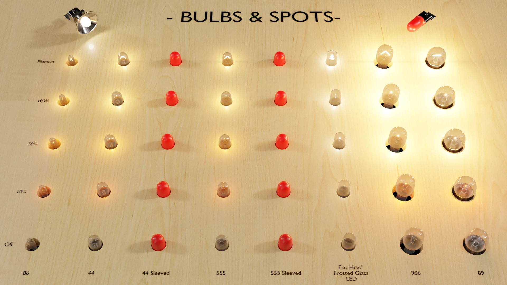
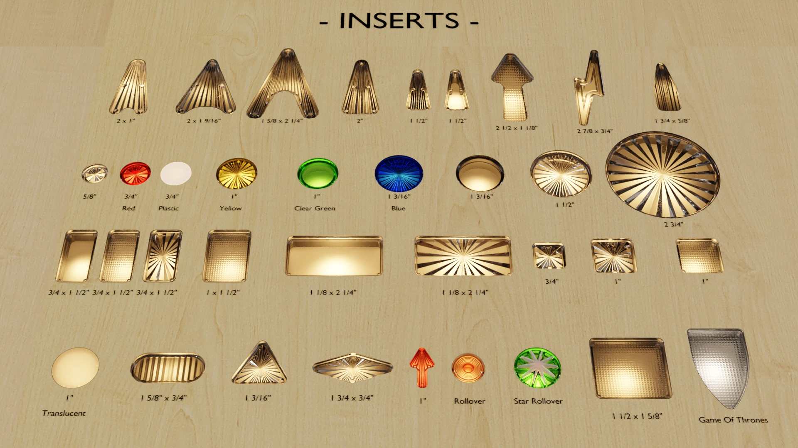

# Blender Pinball Parts library

This projects aims at collecting and sharing assessed blender models of common pinball parts (bats, posts, screws,...) in order to ease the process of recreating these pinball tables in 3D to ultimately recreate them in a virtual simulator like [Visual Pinball X](https://github.com/vpinball/vpinball) or [Visual Pinball Engine](https://github.com/freezy/VisualPinball.Engine).

# Guidelines

Assets are splitted in category folders. When an asset (material, texture, node group,...) is used by multiple other assets, it must be placed in the 'Shared' folder.

Each asset should be marked with the following tags:
- To identify it according to its real life equivalent serial number. The template used is the manufacturer followed by the part number. For example, a clear star 1/16" post will be marked with 'Stern 550-5034-01' as well as 'Williams 03-7542-13'.
- To hint on the quality of the model:
   - Quality Scan: the model is made from a 3D scan of a real part, checked against real part measures.
   - Quality Measure: the model is made based on real part measures.
   - Quality Photos: the model was done from pictures of a real part.
   - Quality Imprecise: for preliminary assets that needs to be checked against real world parts.

When valuable references are availables, they are stored along the modeled part (reference picture, datasheet, measures,...).

All files are 'unpacked' blender files, with there textures stored in a children 'Textures' folder.

# Content

# Helper add-on

To ease the process a little Blender add-on is provided that adds a button to the asset browser view which will generate thumbnail for the selected assets in the asset browser view (open Blender console to see progress since this can be a lengthy operation).

# License

This library is licensed under the CC BY-SA (see license file) except the 'Thin Film Interaction' Nodegroup which is licensed CC BY-NC-SA 4.0.

# Credits

This library was built thanks to the contributions of many authors, namely:
- [Visual Pinball X](https://github.com/vpinball/vpinball): parts from the default table (posts, bats,...)
- [Pinball Maker](https://pinballmakers.com/wiki/index.php?title=Files_Section): inserts, bumpers, lane guides,...
- [Pruster & JettG_G](https://blenderartists.org/t/gpu-compatible-thin-film-interference-v2-1-glass-within-glass-absorption/699459): NodeGroup for thin film interference for metal, plastic and glass (the nodegroup is licensed CC BY-NC-SA, its resulting render are not licensed)
- Flupper: Williams 3" flipper bat, clear bumper cap
- Bord: lane guides, spot lights
- BorgDog: faceted posts, 'Tent' lane guides, and flat head screw
- Sixtoe: covered switch and lock base flasher
- Tomate: ramp starts, flippers for Bally 80 and Data East
- Freezy: 2.5" flipper bat, Williams lane guide, slingshot leaf switch
- Eskar: Williams lane guide
- Niwak: overall library, bulbs, flipper bats, reworked lots of parts,...

